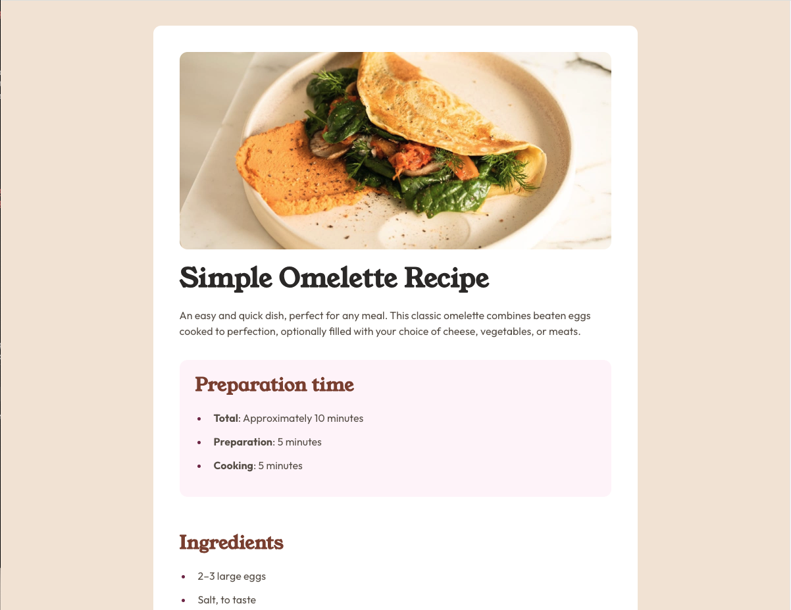

# Frontend Mentor - Recipe page solution

This is a solution to the
[Recipe page challenge on Frontend Mentor](https://www.frontendmentor.io/challenges/recipe-page-KiTsR8QQKm).
Frontend Mentor challenges help you improve your coding skills by building
realistic projects.

## Table of contents

- [Overview](#overview)
  - [Screenshot](#screenshot)
  - [Links](#links)
- [My process](#my-process)
  - [Built with](#built-with)
  - [What I learned](#what-i-learned)
  - [Continued development](#continued-development)
- [Author](#author)

## Overview

This project is a responsive recipe page showcasing a simple omelette recipe.
The design features a clean, modern layout with proper typography hierarchy,
semantic HTML structure, and a mobile-first responsive approach.

### Screenshot



### Links

- Solution URL: [Repo](https://github.com/kmje405/fem-recipe-page)
- Live Site URL: [Live Site](https://fem-recipe-page-kmje405.netlify.app/)

## My process

### Built with

- Semantic HTML5 markup
- CSS custom properties (CSS variables)
- CSS Grid and Flexbox
- Mobile-first workflow
- CSS Cascade Layers (`@layer`)
- Custom font loading with `@font-face`
- Responsive design with clamp() for fluid typography
- CSS logical properties for better internationalization

### What I learned

This project reinforced several important web development concepts:

**Semantic HTML Structure**: Used proper semantic elements like `<article>`,
`<section>`, `<aside>`, and `<header>` to create meaningful document structure:

```html
<article class="recipe" aria-labelledby="recipe-title">
  <header class="recipe__intro">
    <h1 id="recipe-title" class="recipe__title">Simple Omelette Recipe</h1>
  </header>
  <aside class="recipe__prep">
    <h2 class="recipe__section-title">Preparation time</h2>
  </aside>
</article>
```

**CSS Custom Properties for Design System**: Implemented a comprehensive design
token system:

```css
:root {
  /* Colors */
  --c-rose-50: hsl(330, 100%, 98%);
  --c-stone-900: hsl(24, 5%, 18%);

  /* Typography */
  --ff-outfit: "Outfit", system-ui, sans-serif;
  --ff-young-serif: "Young Serif", ui-serif, Georgia, serif;

  /* Spacing */
  --space-800: 2rem;
}
```

**Modern CSS Techniques**: Used CSS Cascade Layers for better organization and
fluid typography with clamp():

```css
@layer global {
  /* Global styles organized in layers */
}

.recipe__title {
  font-size: clamp(2rem, 1.6rem + 1.5vw, var(--fs-40));
}
```

**Accessible List Styling**: Created custom list markers while maintaining
semantic meaning:

```css
ul li::marker,
ol li::marker {
  color: var(--c-rose-800);
  font-weight: var(--fw-bold);
}
```

### Continued development

Areas I want to continue focusing on in future projects:

- **Advanced CSS Grid**: Exploring more complex grid layouts and subgrid
- **Container Queries**: Implementing component-based responsive design
- **CSS Animations**: Adding subtle micro-interactions to enhance user
  experience
- **Performance Optimization**: Further optimizing font loading and image
  delivery
- **Accessibility**: Implementing more advanced ARIA patterns and testing with
  screen readers

## Author

- Website - [Eastland Jones Creative LLC](https://eastlandjones.com/)
- Frontend Mentor - [@kmje405](https://www.frontendmentor.io/profile/kmje405)
